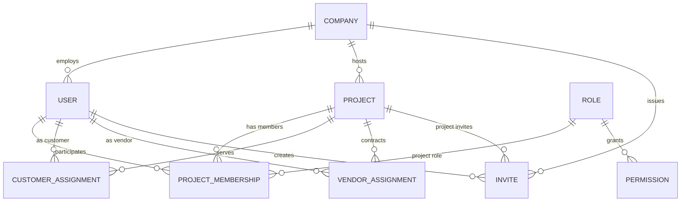
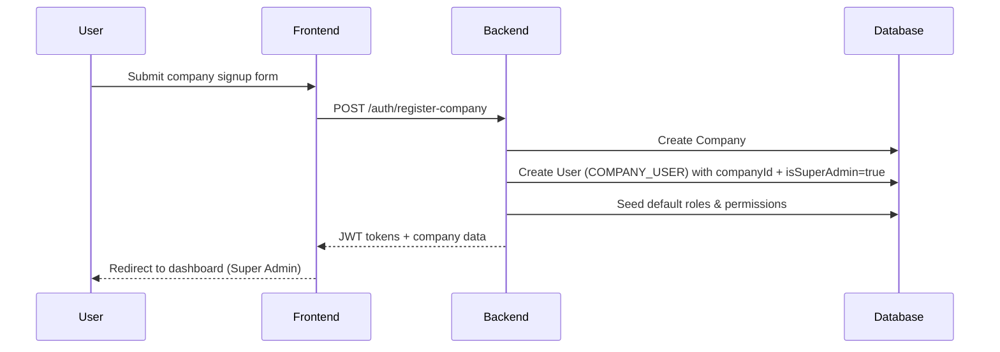
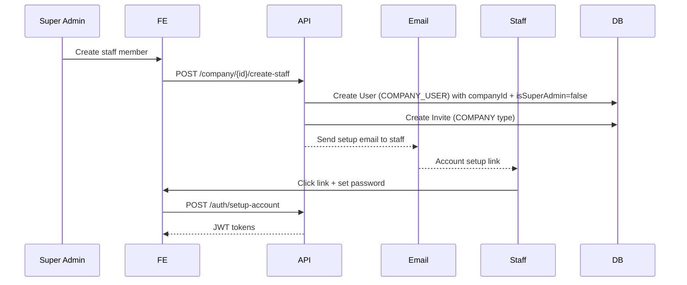
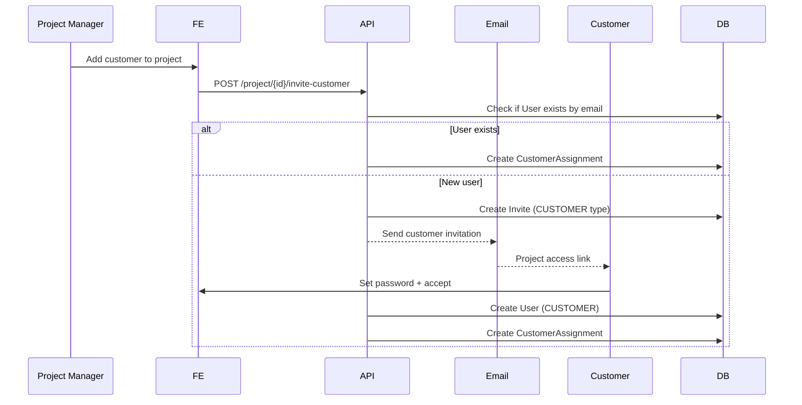
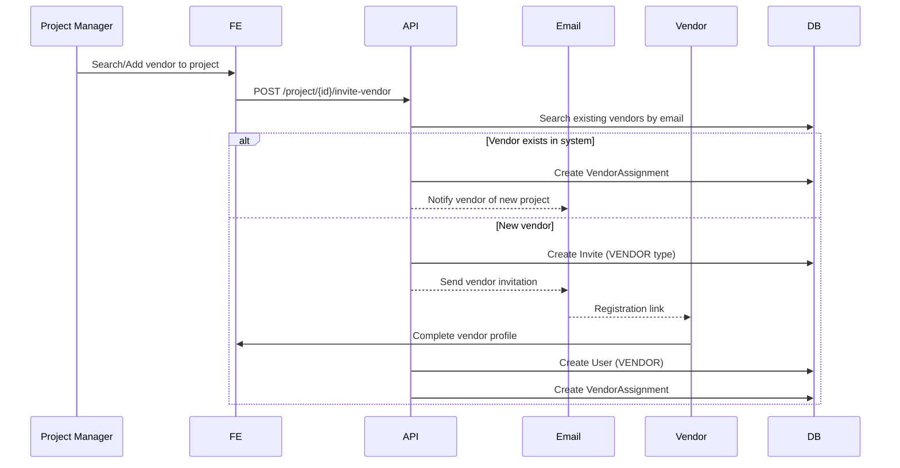
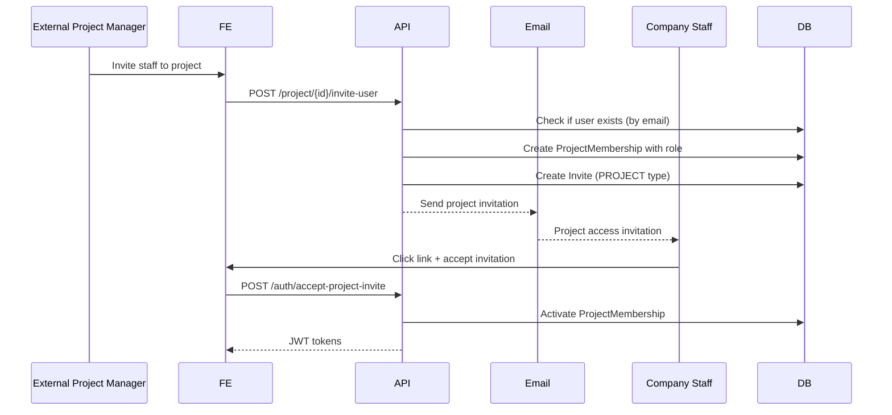
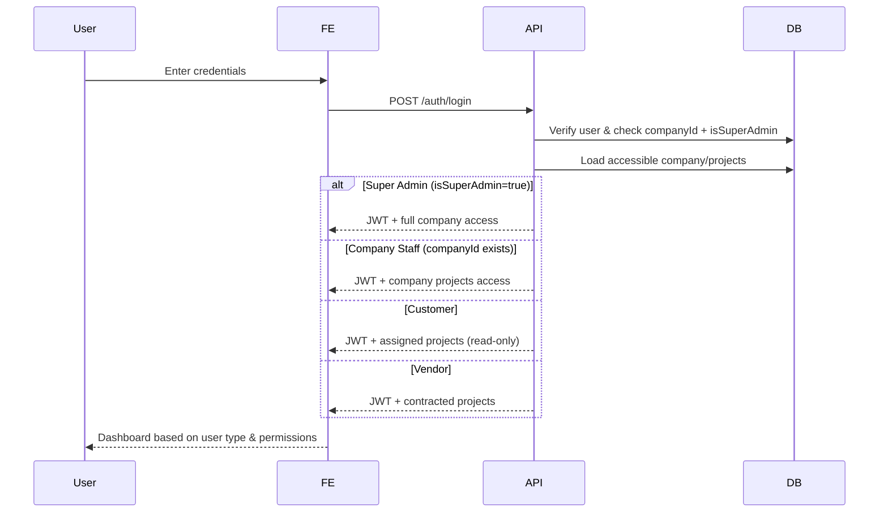

# User & On-Boarding Flow

## 1. Entity Hierarchy



### Key Changes:
* **Company table** separate from User table
* **User table** with companyId for company staff
* **Super Admin flag** (isSuperAdmin) to identify company owner
* **Company Staff** (companyId + not super admin) can create projects
* **External users** (customers, vendors, freelancers) can be invited to projects
* **Simple permission model** - Super Admin > Company Staff > External Users

---

## 2. Updated Prisma Schema

```prisma
enum UserType {
  COMPANY_USER    // Internal company staff
  CUSTOMER        // End client
  VENDOR          // External supplier
  FREELANCER      // Independent contractor
}

enum InviteType {
  COMPANY         // Join company as staff
  PROJECT         // Join project
  CUSTOMER        // Customer access to project
  VENDOR          // Vendor access to project
}

model Company {
  id          String   @id @default(cuid())
  name        String
  slug        String   @unique
  logo        String?
  website     String?
  address     String?
  createdAt   DateTime @default(now())
  
  // Relationships
  users       User[]   // Company staff
  projects    Project[]
  invites     Invite[]
}

model User {
  id                     String                   @id @default(cuid())
  email                  String                   @unique
  passwordHash           String?                  // nullable for invited users
  fullName               String
  userType               UserType                 @default(COMPANY_USER)
  companyName            String?                  // for vendors/customers
  phoneNumber            String?
  profileImage           String?
  isActive               Boolean                  @default(true)
  isSuperAdmin           Boolean                  @default(false)  // Company owner flag
  lastLoginAt            DateTime?
  createdAt              DateTime                 @default(now())
  
  // Company relationship (required for company staff)
  company                Company?                 @relation(fields: [companyId], references: [id])
  companyId              String?                  // Required for company staff
  
  // Relationships
  projectMemberships      ProjectMembership[]
  customerAssignments     CustomerAssignment[]
  vendorAssignments       VendorAssignment[]
  sentInvites            Invite[]                 @relation("Inviter")
  receivedInvites        Invite[]                 @relation("Invitee")
}

model Project {
  id             String       @id @default(cuid())
  name           String
  description    String?
  startDate      DateTime?
  endDate        DateTime?
  status         String       @default("PLANNING")
  company        Company      @relation(fields: [companyId], references: [id])
  companyId      String
  createdAt      DateTime     @default(now())
  
  memberships         ProjectMembership[]
  customerAssignments CustomerAssignment[]
  vendorAssignments   VendorAssignment[]
  invites            Invite[]
}

model ProjectMembership {
  id        String  @id @default(cuid())
  user      User    @relation(fields: [userId], references: [id])
  userId    String
  project   Project @relation(fields: [projectId], references: [id])
  projectId String
  role      Role    @relation(fields: [roleId], references: [id])
  roleId    String
  joinedAt  DateTime @default(now())
  isActive  Boolean  @default(true)
  
  @@unique([userId, projectId])
}

model CustomerAssignment {
  id        String  @id @default(cuid())
  user      User    @relation(fields: [userId], references: [id])
  userId    String
  project   Project @relation(fields: [projectId], references: [id])
  projectId String
  assignedAt DateTime @default(now())
  isActive   Boolean  @default(true)
  
  @@unique([userId, projectId])
}

model VendorAssignment {
  id           String   @id @default(cuid())
  user         User     @relation(fields: [userId], references: [id])
  userId       String
  project      Project  @relation(fields: [projectId], references: [id])
  projectId    String
  specialization String?  // e.g., "Electrical", "Plumbing"
  assignedAt   DateTime @default(now())
  isActive     Boolean  @default(true)
  
  @@unique([userId, projectId])
}

model Role {
  id                      String                   @id @default(cuid())
  name                    String
  description             String?
  isSystemRole            Boolean                  @default(false)
  companyId               String?                  // null for system roles
  permissions             Permission[]
  projectMemberships      ProjectMembership[]
}

model Permission {
  id          String @id @default(cuid())
  code        String @unique // e.g. "CREATE_TASK", "VIEW_CUSTOMER_DATA"
  name        String
  description String?
  category    String // e.g. "PROJECT", "USER_MANAGEMENT", "GOV_APPROVAL"
  roles       Role[]
}

model Invite {
  id             String       @id @default(cuid())
  email          String
  token          String       @unique
  inviteType     InviteType
  expiresAt      DateTime
  acceptedAt     DateTime?
  message        String?      // Custom invite message
  
  // Context - what they're being invited to
  company        Company?     @relation(fields: [companyId], references: [id])
  companyId      String?
  project        Project?     @relation(fields: [projectId], references: [id])
  projectId      String?
  roleId         String?      // Suggested role
  
  // Who sent the invite
  invitedBy      User         @relation("Inviter", fields: [invitedById], references: [id])
  invitedById    String
  
  // Who received it (nullable until accepted)
  invitee        User?        @relation("Invitee", fields: [inviteeId], references: [id])
  inviteeId      String?
  
  createdAt      DateTime     @default(now())
}
```

---

## 3. Updated On-Boarding Workflows

### 3.1 Company Registration (Super Admin)



### 3.2 Create Company Staff



### 3.3 Invite Customer to Project



### 3.4 Invite/Add Vendor to Project



### 3.5 Cross-Company Project Invitation (Staff to External Project)



### 3.6 Login Flow (All User Types)



---

## 4. User Context & Permissions

### 4.1 Dashboard Views by User Type

| User Type | Dashboard Shows |
|-----------|----------------|
| Super Admin (isSuperAdmin=true) | All company data + admin functions + staff management |
| Company Staff (companyId exists) | Company projects + create/manage projects |
| CUSTOMER | Only assigned projects (read-only progress) |
| VENDOR | Contracted projects + PO/invoice management |
| FREELANCER | Assigned tasks across multiple companies |

### 4.2 Permission Evaluation

```typescript
// Ultra-simplified permission check
function checkPermission(user: User, permission: string, context: {companyId?, projectId?}) {
  // Super Admin has all permissions for their company
  if (user.isSuperAdmin && user.companyId === context.companyId) {
    return true; // Super Admin has all permissions
  }
  
  // Company Staff can create projects and manage company operations
  if (user.companyId && context.companyId === user.companyId) {
    return ['CREATE_PROJECT', 'MANAGE_TASKS', 'VIEW_COMPANY_DATA'].includes(permission);
  }
  
  // External users have project-level permissions when invited
  if (context.projectId) {
    return user.projectMemberships
      .find(m => m.projectId === context.projectId)
      ?.role.permissions.includes(permission)
  }
  
  return false;
}
```

---

## 5. Key Benefits of This Approach

1. **Ultra-Simple Model** - Company + User tables with isSuperAdmin flag
2. **Clear Hierarchy** - Super Admin > Company Staff > External Users
3. **Direct Staff Creation** - Super Admin creates staff users directly (no invites needed)
4. **Vendor Reusability** - Vendors can work with multiple companies without re-registration
5. **Minimal Permission Logic** - Super Admin (all), Staff (company operations), External (project-only)
6. **Staff Visibility** - Clear relation between staff and company through companyId
7. **Cross-Company Collaboration** - Staff can be invited to other company projects

---

## 6. Next Implementation Steps

1. Create migration with updated schema (add isSuperAdmin flag)
2. Implement Super Admin dashboard:
   - View all company staff
   - Create new staff users
   - Manage company settings
3. Implement Company Staff dashboard:
   - Create and manage projects
   - View company data
   - Invite external users to projects
4. Build staff management UI:
   - Staff list view
   - Staff creation form
   - Staff permissions display
5. Update permission middleware for simplified logic
6. Add cross-company project invitation system
